# Build 28 painted enemy review

All 19 assets loaded in the compiled gallery. This is not full encounter coverage or owner visual acceptance.

## wanderingSoldier

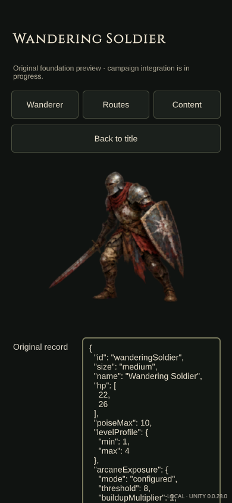

## blightHound

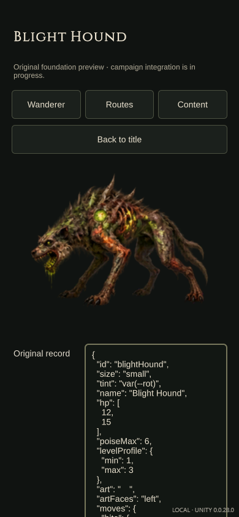

## graveWisp

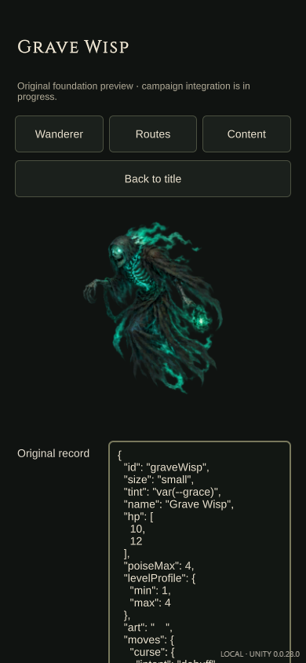

## wyrmAspirant

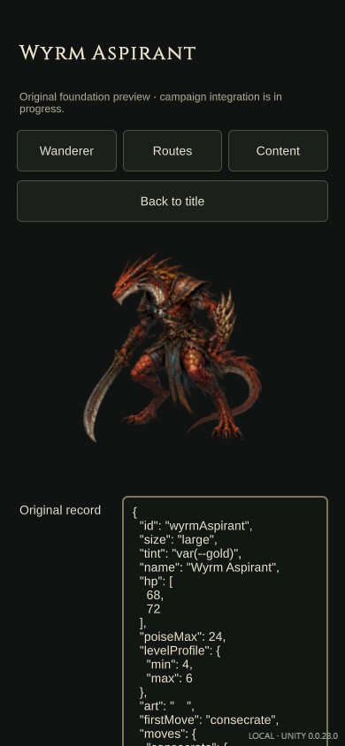

## fellWarden

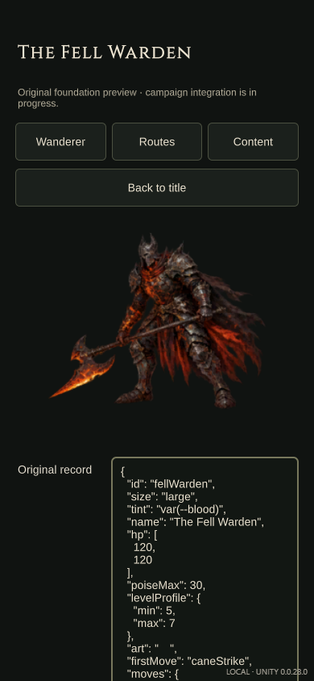

## gildedKnight

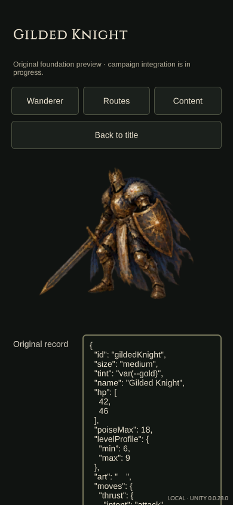

## courtSurgeon

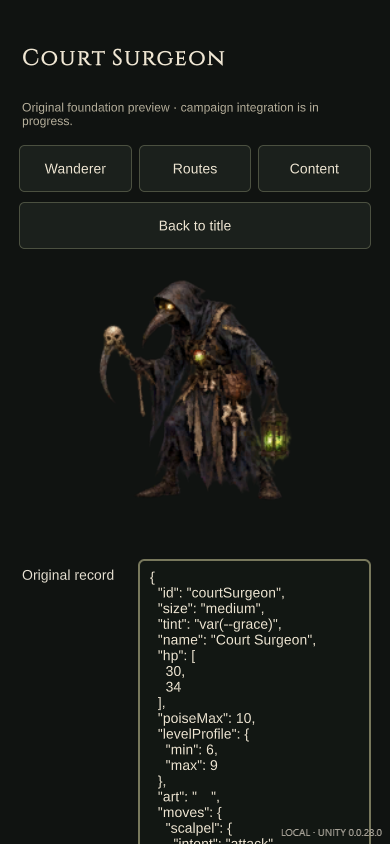

## livingArmor

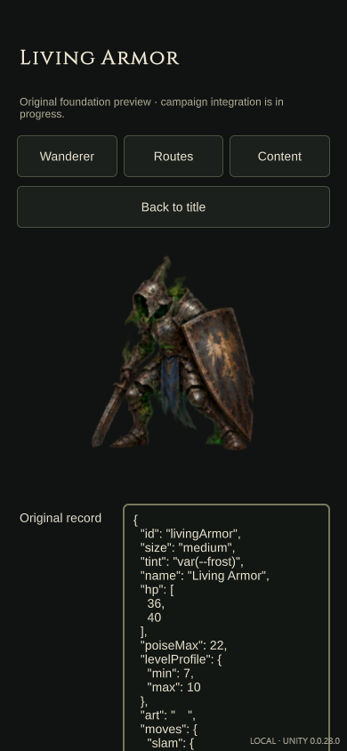

## courtDuelist

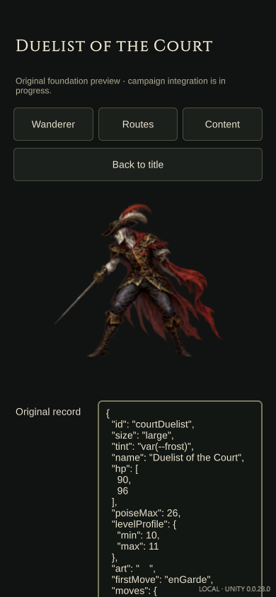

## stitchedKing

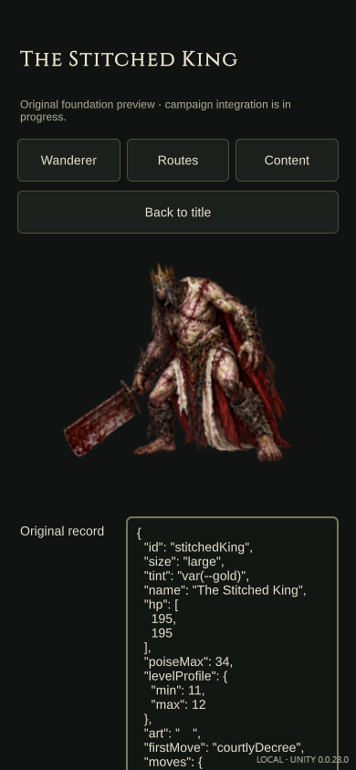

## valkyrieShade

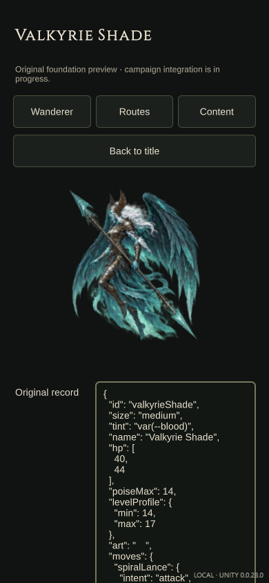

## wyrmLord

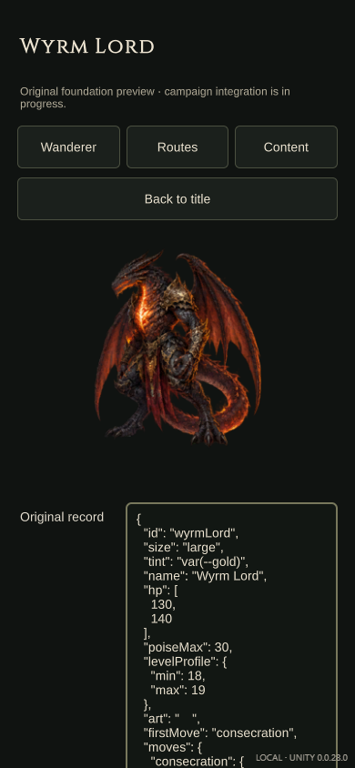

## huskBrute

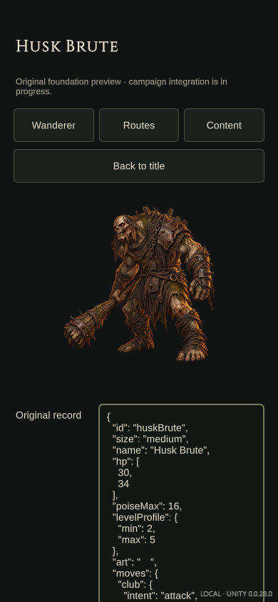

## stitchedHound

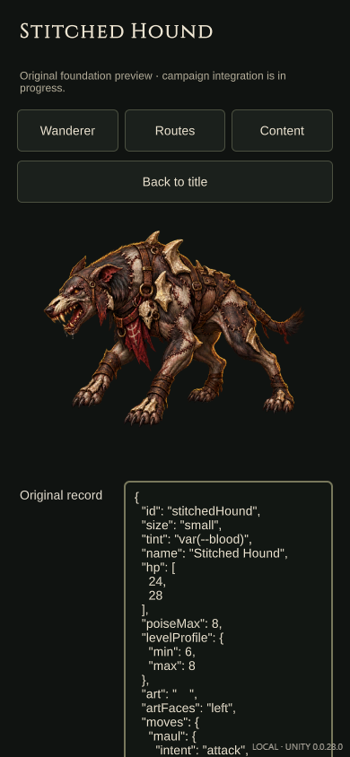

## courtMarionette

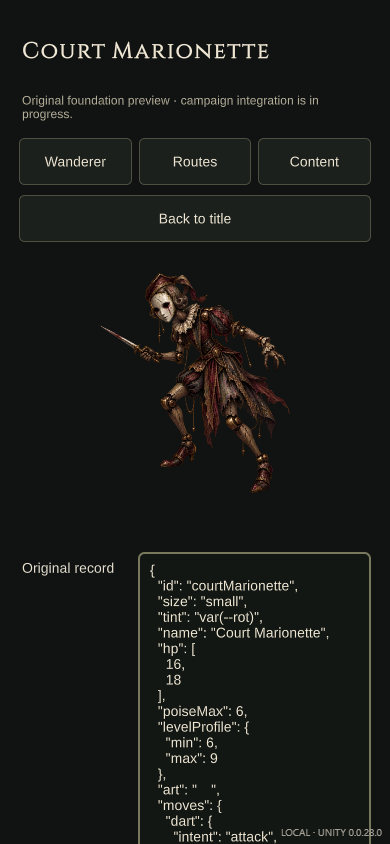

## ashRevenant

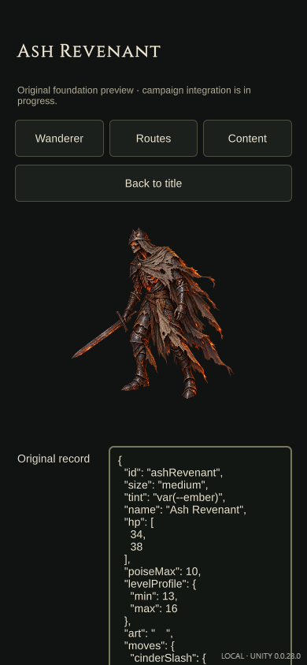

## emberStarvedPilgrim

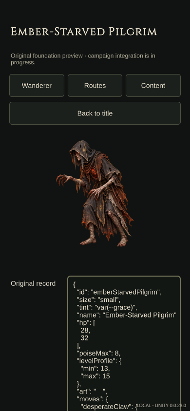

## charredColossus

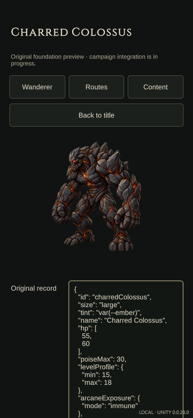

## blightedValkyrie

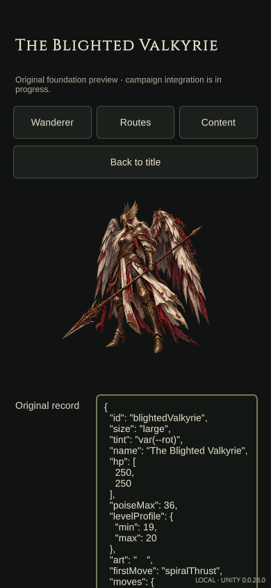
