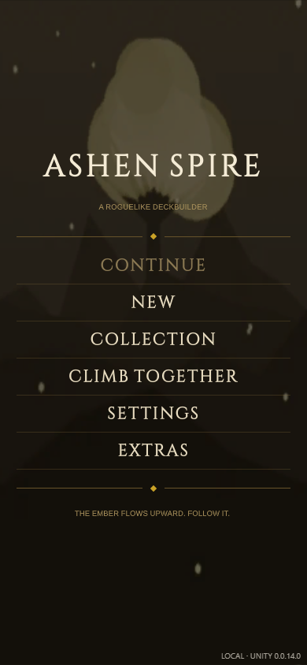
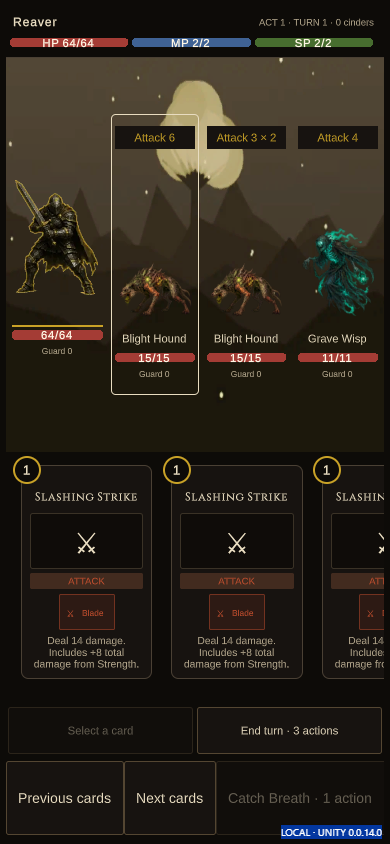
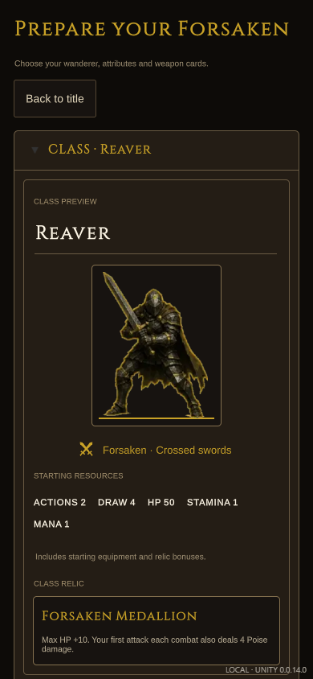
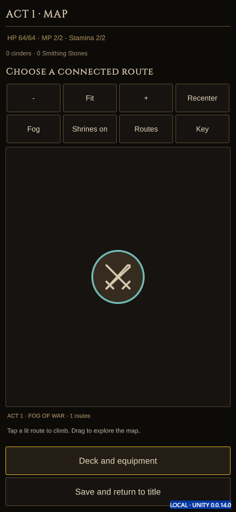
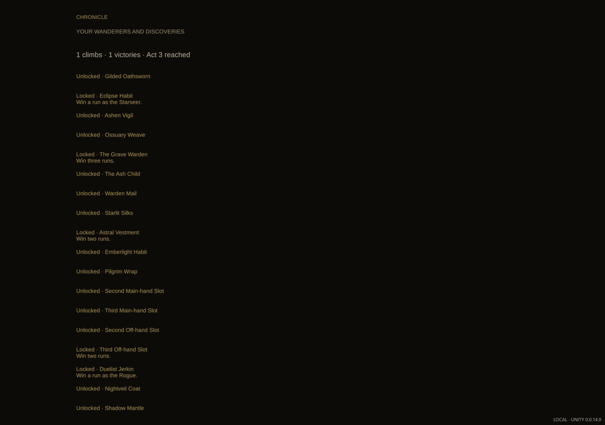
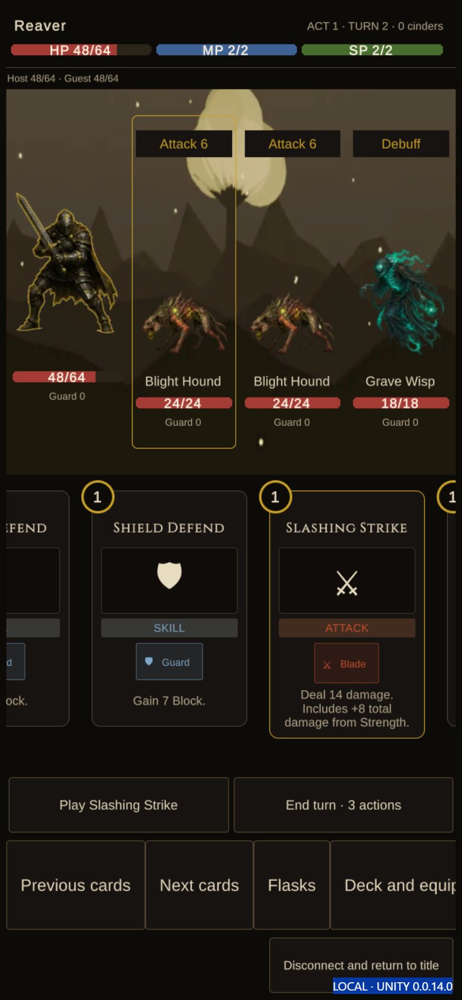

# Ashen Spire: player guide

A friendly guide to playing the Unity version of Ashen Spire. It describes
what the game does today (source **0.0.14.0 · build 14**). Where the original
HTML game has something the Unity version does not have yet, this guide says so.

> Editing or building the game? See the [owner guide](Unity-Owner-Guide.md).

## What is Ashen Spire?

Ashen Spire is a **deckbuilding roguelike**. You pick a hero, then climb a
tower (the Spire) through three acts. Each floor you choose a room on a
branching map. Most rooms are fights, and you fight by playing **cards**.
Your weapons give you your cards. Win fights, collect loot, get stronger, and
beat the boss at the top of each act. If you fall, the run ends and you start
a new climb, with what you have unlocked.

Every run is different, but a **seed** (a number) makes a run repeatable, so
you can share a good one with a friend.

## Where to play

- **In a browser:** the build pages at
  <https://cehinds.github.io/AshenSpire-Unity/> (channels Dev, Test, Release,
  Main). Each page says which version it hosts; a channel can be behind the
  newest build.
- **Windows or Android:** download the Windows zip or Android APK from the same
  build page.
- **Playing together:** needs the Windows companion app (see [Co-op](#co-op-basics)).

## How to play in 5 minutes

1. On the title screen, tap **New**.
2. Pick a class (try the **Reaver**). Leave the points as they are, or put a few
   into the stats you like. Tap **Begin the climb**.
3. On the map, tap a **lit** room next to you. Start with a fight.
4. In a fight: **tap a card**, **tap an enemy** to target it, then tap **Play**.
   Each card costs actions (and sometimes MP or stamina). The Play button tells
   you if you can't afford a card.
5. Look at each enemy's **intent** above it: it tells you what the enemy will
   do on its turn (for example "Attack 8"). If a big hit is coming, play Guard cards.
6. When you are out of actions or good plays, tap **End turn**.
7. Win, then collect your spoils. Pick the rewards you want and go back to the map.
8. Visit a **shrine** when you are hurt. Beat the boss at the top of the act.
9. Tap **Save and return to title** whenever you need to stop. **Continue**
   brings you right back.

## Controls

The Unity version is built for **tap first**. A mouse click works the same as a tap.

| What | Touch / mouse | Keyboard |
|---|---|---|
| Choose a card | Tap the card | — |
| Choose a target | Tap the enemy (or an ally, in co-op) | — |
| Play the chosen card | Tap **Play** | — |
| End your turn | Tap **End turn** | — |
| See more cards | Swipe or scroll the hand sideways, or tap **Previous cards / Next cards** | — |
| Read a long card | Scroll up and down inside the hand | — |
| Move around the map | Drag the map; mouse wheel scrolls | PageUp / PageDown / Home / End (map selected) |
| Zoom the map | **−**, **Fit**, **+**, **Recenter** buttons | Ctrl + mouse wheel |
| Pick a room | Tap a lit room | — |

Keyboard shortcuts and gamepad support from the HTML game (E to end turn,
F/G/H flasks, M menu, rebinding, and so on) are **not in the Unity version
yet**. They are planned (roadmap F15).

## Classes

You choose one of four classes. Each has its own cards, starting relic and style.

| Class | Health | Play style |
|---|---|---|
| **Reaver** | 84 | Fights up close and switches stance mid-battle: one stance hits harder, the other holds the line. Wounds keep bleeding, and heavy blows stagger. Good first pick. |
| **Starseer** | 72 | A spellcaster. The second spell each turn hits harder than the first, so card order matters. Fragile early on. |
| **Rogue** | 74 | Sets up an opening, then uses speed, poison and opportunism for big strikes. |
| **Herald** | 78 | Spends its own health to act, then heals it back. Spreads a blight that hurts enemies over time. |

**Stats.** There are five attributes (STR, DEX, INT, WIS, CON). All start at 5
and you get **35 points** to spend (max 15 each). Every point helps: STR, DEX,
INT and WIS add damage to matching attacks, WIS also adds healing, and CON adds
health. At every 5 points, DEX gives an extra action and INT an extra card
drawn. Prefer presets? Switch to **Standard**.

You can also choose an **appearance style** (Animated, Rendered, Classic or
Sigil), a tint and a sigil, and later unlock more starting kits.

## Fighting, simply

**Your turn**

- You get some **actions** each turn (usually two, more with DEX). Most cards
  cost actions. The End turn button shows how many are left.
- Some cards also cost **MP** (mana, blue) or **SP** (stamina). MP carries over
  between fights; flasks and shrines restore it.
- **Catch Breath** (solo only): spend 1 action to get 1 stamina, once per turn.
- Cards you play go to the discard pile. When your draw pile runs out, the
  discard pile is shuffled back in.

**Guard.** Guard (block) soaks up damage before your health. It goes away at
the start of your next turn, so use it for the hit that's coming.

**Intents.** Every enemy shows what it will do next: attack (with the damage,
like "8 × 2" for two hits), guard, buff, debuff and so on. Read them before
ending your turn. "Committed" means the move is locked in.

**Poise and Stagger.** Enemies have hidden **Poise**. Heavy blows and some
statuses wear it down. When it breaks, the enemy is **Staggered**: it loses
its next turn and takes extra damage for a short while. The Unity version shows
the Staggered status but does not draw a Poise bar yet.

**Statuses** (small labels next to a fighter, with a number):

| Status | What it means |
|---|---|
| Strength | Your attacks hit harder |
| Dexterity | Your Guard cards give more Guard |
| Weak | Deals less attack damage |
| Vulnerable | Takes more attack damage |
| Frail | Gets less Guard from cards |
| Bleed / Frost / Insanity | Build up a meter; when it fills, the target takes a burst of damage |
| Crimson Blight | Loses health every turn for a few turns, ignoring Guard |
| Burn | Another damage-over-time effect |
| Regen | Heals over time |
| Madness | Hurts you each turn but gives extra actions |

## The map and rooms

Each act is a branching map. You climb from the bottom to the boss at the top.
You can only move to a room connected to where you are; those rooms are lit.

| Room | What happens |
|---|---|
| Fight | A normal battle. Rewards afterwards. |
| Elite | A tougher battle with better rewards (including a Smithing Stone). |
| Boss | The act's final fight. |
| Event | A short story with choices. Choose carefully. |
| Unknown (?) | Could be an event, fight, shrine or treasure. |
| Shrine | Rest and prepare (see below). |
| Merchant | Spend cinders. |
| Treasure | Free loot. |

**Fog.** In a solo climb, rooms you haven't seen stay hidden in fog. A
**Sealstone Key** reveals rooms ahead. Map buttons: **Fog / Paths** switches the
view, **Shrines on/off** shows the route to the nearest shrine, **Routes** lists
your options in words, and **Key** explains the colours (gold = where you've
been, teal = nearest shrine, bright ring = you can go here).

## Flasks

- **Crimson** charges heal you. **Azure** charges restore MP. They share one
  pool of charges. Tap the Crimson or Azure button in a fight to drink.
- Utility flasks (for example Flask of Ferocity, Flask of Stone, Blight
  Coating, Blood Unction, Wondrous Draught) have special effects. Some need a target.
- Your flask charges **refill when you arrive at a shrine**, and there you can
  change the Crimson/Azure split.

## Merchants, shrines and events

- **Merchant:** buy cards, relics and flasks with **cinders** (the money you
  earn from fights). You can sell some relics and utility flasks back, and pay
  to remove a card from your deck.
- **Shrine:** rest to restore health and mana, re-split your flasks, and spend
  cinders on level points to raise attributes. You may also leave without resting.
- **Events:** read the story and pick a choice. Some choices need items or
  earlier events.
- **Deck and equipment** (button on most screens): see your deck, switch
  prepared weapon sets, improve weapons with Smithing Stones, and move weapon
  cards between mounts.

## Saving

- The game **saves automatically** after every accepted move.
- **Save and return to title** stops safely; **Continue** resumes exactly.
- Saves live on this device and browser (and are separate for each build
  channel). Clearing site data or switching browsers starts fresh.
- There is one saved run at a time. Multiple save slots from the HTML game are
  not in the Unity version yet.

## Other ways to play

- **Custom Climb:** choose an Ascension level (0–6) for extra difficulty and
  add modifiers. Also **Sealed** and **Draft** starts (Draft lets you pick
  cards for your starting deck over three rounds).
- **Endless:** keep climbing past Act 3 as enemies grow stronger.
- **Collection:** your Chronicle of past wanderers, runs and unlocks.

## Co-op basics

Two to four players can climb together on the same network.

1. One person runs the **companion app** on a Windows PC (it comes in the
   Companion zip on the build page, with its own README) and opens the game
   from the address it shows.
2. Everyone taps **Climb together**, enters the **companion address** and the
   **invitation code**. Only the host uses the host key.
3. Choose your wanderer, tap **I'm ready**. The host sets the seed (and
   Endless, if wanted) and taps **Begin shared climb**.
4. On the map everyone **votes** for the next room. In fights you each play
   your own hand and end your own turn; the enemies act when everyone is done.
   Some cards and flasks can target allies.
5. Disconnected? Tap **Rejoin saved seat**.

The browser build pages can't host co-op on their own; you need the companion.
Catch Breath and paying to switch weapon sets mid-fight are solo-only.

## Settings

Title → **Settings**. Your choices save on this device.

- **Reduced motion**: less movement on screen.
- **Quick animations**: faster feedback.
- **Mute sound**.

Settings also has a short **How to play** section. Music, volume sliders, text
size, high contrast and colorblind options from the HTML game are planned
(roadmap F08, F13, F15).

## Glossary

| Word | Meaning |
|---|---|
| Action | What most cards cost; refreshes every turn |
| MP | Mana; pays for spells; carries between fights |
| SP | Stamina; pays for physical techniques |
| Guard | Block; absorbs damage this turn |
| Intent | What an enemy will do next |
| Poise / Stagger | Enemy balance; when broken the enemy loses a turn |
| Cinders | Money |
| Relic | A permanent passive bonus for the run |
| Armament | A weapon; it supplies cards |
| Smithing Stone | Upgrades an armament (from elites and bosses) |
| Shrine | Rest stop; refills flasks |
| Sealstone Key | Reveals fogged rooms |
| Seed | Number that fixes a run's map and offers |
| Forsaken | What the game calls you, the hero |
| Ascension | Extra difficulty levels in Custom Climb |

## FAQ

**The game shows only a loading bar.** Unity's web version is a large
download. Wait, and use an up-to-date desktop or phone browser.

**No sound?** Browsers only allow sound after you tap or click once. Check
**Mute sound** in Settings.

**Why can't I play this card?** The Play button explains: usually not enough
actions, MP or stamina, or the card can't be played.

**I lost my run.** Runs are saved in the browser for that channel. A different
browser, a private window or cleared site data won't have it.

**Can I play with a keyboard or controller?** Not yet in Unity; use mouse or touch.

**Which build am I playing?** The build page shows the version and build
number; the Unity build currently in source is 0.0.14.0, build 14.
