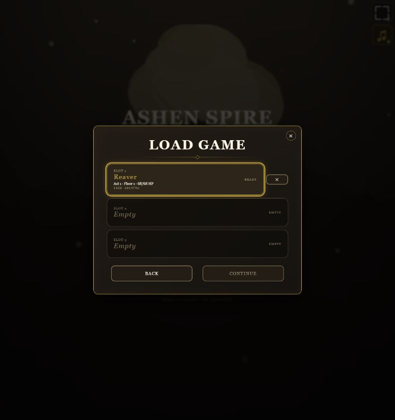
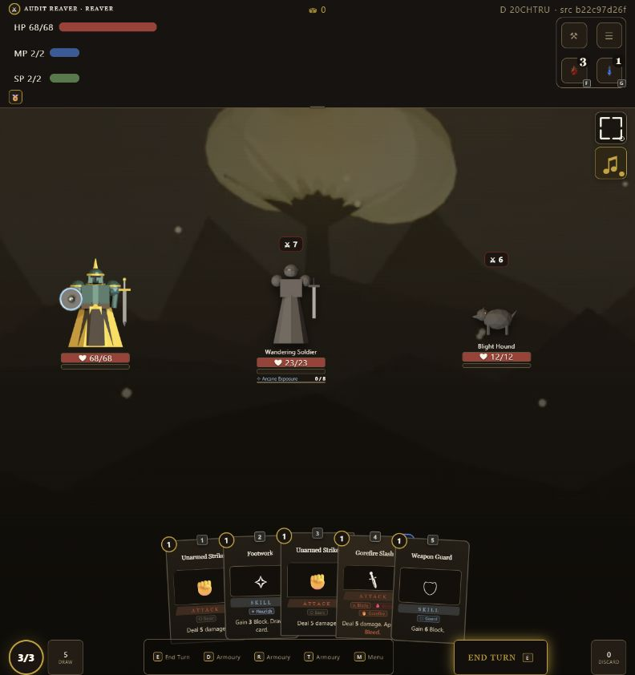
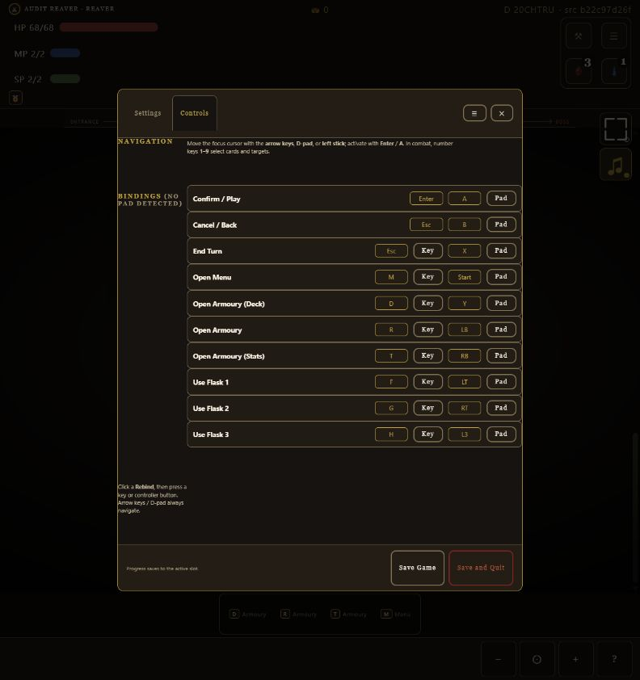
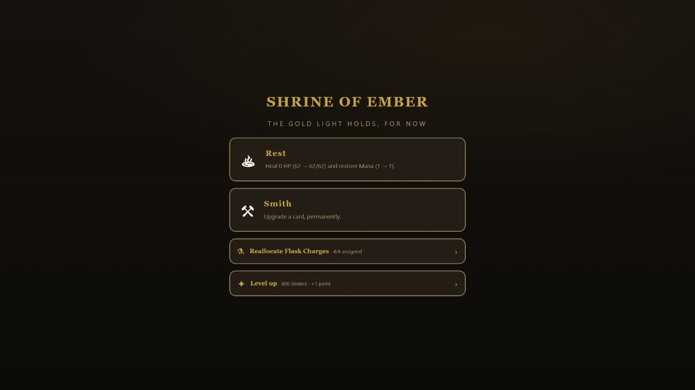
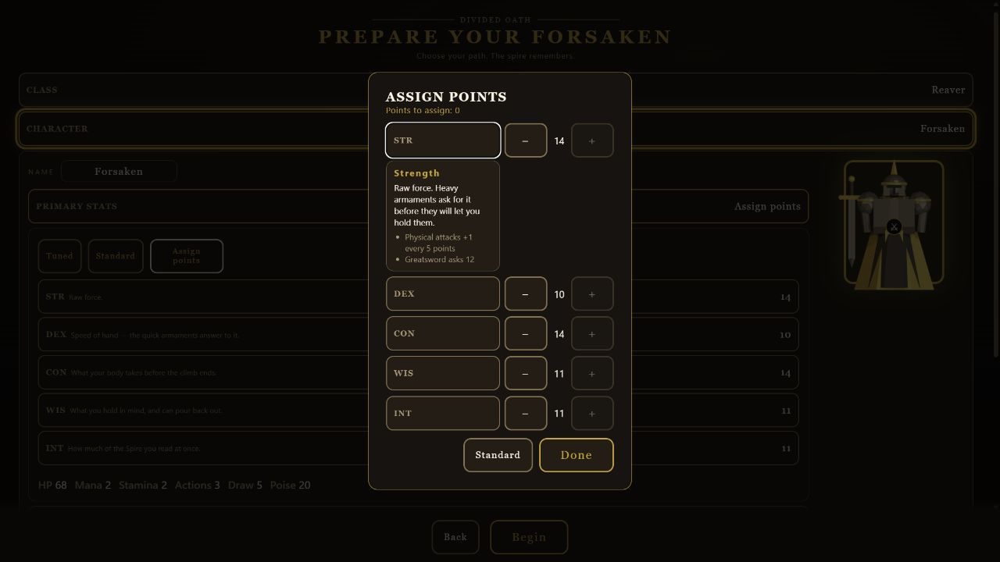
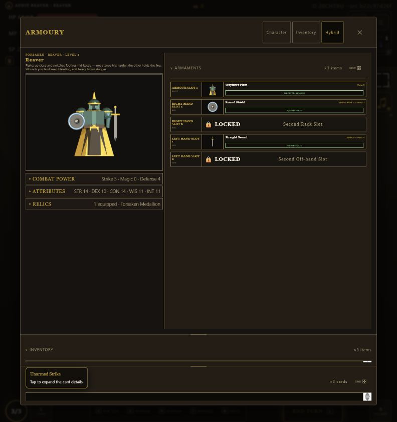
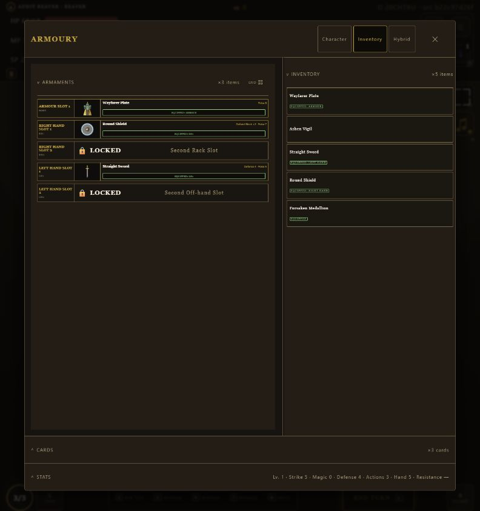
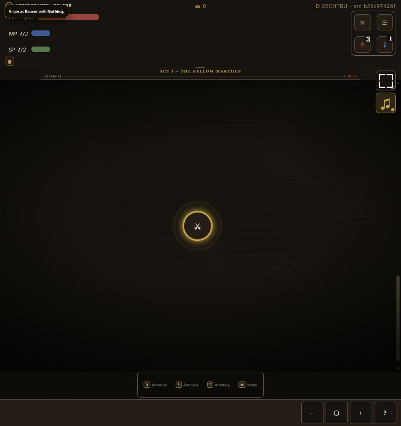
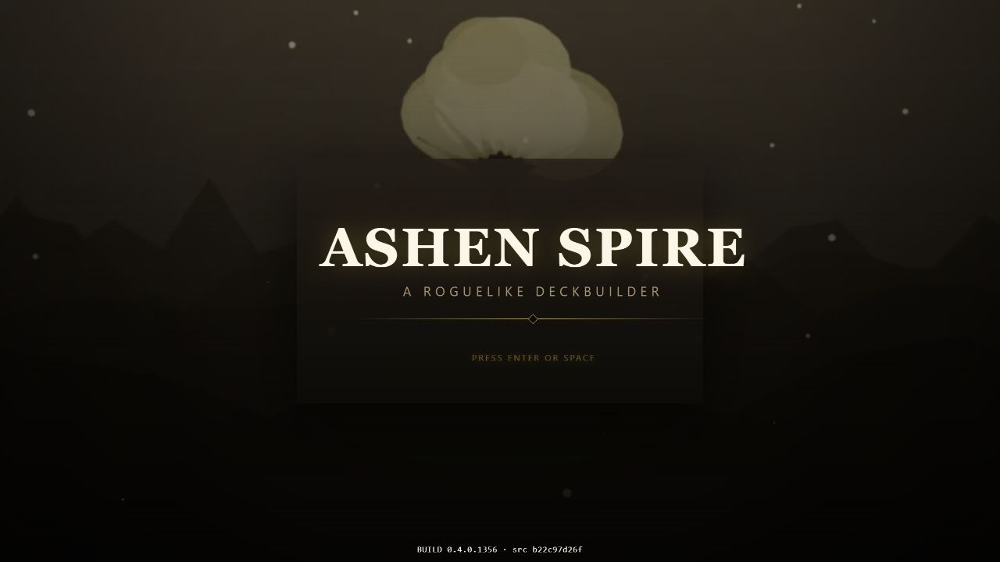

# QA review — build 0.4.0.1356

## Scope and provenance

- Playable artifact: `dist/AshenSpire.html`
- Displayed build: `0.4.0.1356`
- Displayed source receipt: `b22c97d26f`
- Worktree HEAD during review: `78a6e58f9604` (`origin/dev` matched)
- Browser: Codex in-app browser
- Viewports exercised: desktop `1280x720`, responsive phone override (reported inner viewport approximately `433x938`), plus existing `792x842` audit surface
- Save: slot 1, Reaver, seed `20CHTRU`
- Important boundary: the worktree contained unbundled character-attribute and tooltip work. This review judged the existing generated build above, not those source edits.

## Health

**Needs fixes before treating this as a polished player build.** Combat is playable and the main navigation works, but persistence, Load selection, rebinding, shrine commitment, and Armoury tray sizing contain high-impact failures.

## Findings

### 1. [P1] Load can look selected while Continue is disabled

Clicking the already selected slot removed its pressed state and disabled Continue. A later click did not recover the action during the same dialog session.



Proposed fix:

```text
LOAD GAME
┌──────────────────────────────────┐
│ ● SLOT 1  Reaver · Floor 1       │  selected cards cannot toggle off
│ ○ SLOT 2  Empty                  │
│ ○ SLOT 3  Empty                  │
└──────────────────────────────────┘
[ Back ]                  [ Continue ]  always enabled for a valid selection
```

Use one selected-slot model shared by visual state and the Continue command. Clicking the selected slot should be an idempotent no-op.

### 2. [P1] Save in combat does not restore the state the player just saved

Before Save Game: HP `68`, MP `1/2`, Crimson `2`, and the damaged encounter was in progress. After Save and Quit -> Continue: HP remained `68`, but MP returned to `2/2`, Crimson returned to `3`, and the encounter restarted with new/full enemy state.



Proposed fix — choose and state one contract:

```text
Option A: exact combat save
[ Save Game ] -> same hand, enemies, intent, MP, flasks, and timeline

Option B: checkpoint save
[ Save Checkpoint ]
"Combat restarts from node entry; combat resources are restored."
```

Do not call a checkpoint an exact Save. Serialize exact combat state or relabel/confirm the checkpoint behavior.

### 3. [P1] Escape can become End Turn and conflict with Cancel/Back

While rebinding End Turn, pressing Escape both closed the menu and saved Escape as the new binding. Reopening Controls showed both Cancel/Back and End Turn on Escape.



Proposed fix:

```text
REBIND END TURN
Press a key…

Esc = Cancel rebind        never accepted as gameplay input here
E   = current binding

Conflict found:
[ Replace existing ] [ Choose another ] [ Cancel ]
```

The capture service must consume Escape as cancellation before modal close or binding mutation, then enforce a conflict policy.

### 4. [P1] Shrine choices leave immediately without the requested review step

Rest and Smith are visually card-like but are not exposed as semantic buttons in the accessibility tree. Clicking Rest left the shrine immediately. The player was not shown the exact result, whether the choice leaves the shrine, or Back/Continue.



Proposed fix:

```text
REST — REVIEW                         LEAVES SHRINE
┌──────────────────────────────────────────────┐
│ HP 34  +16 (green)  -> 50/50                │
│ MP  1   +3 (green)  ->  4/4                 │
│ This ends your shrine visit.                 │
└──────────────────────────────────────────────┘
[ Back ]                              [ Rest & Continue ]
```

Use the shared confirmation overlay for every committed shrine action; label leaving actions explicitly.

### 5. [P1] Smith opens an unlabeled card dump and upgrades immediately

> Follow-up: the dedicated Smith modal remediation is tracked in
> [the Smith design and QA write-up](2026-08-25-smith-modal-design.md). This
> baseline evidence remains unchanged until the exact replacement build passes.

Smith appended the whole deck below the shrine without a step title, instructions, selection state, preview, cancel, or confirmation. Clicking the first card immediately left the shrine and applied the upgrade.


Proposed fix:

```text
SMITH — CHOOSE ONE CARD
[ Back to shrine ]                       20 eligible

[ Slashing Strike ]  [ Shield Defend ]  [ ... ]

SELECTED: SLASHING STRIKE
Before: Deal 7 damage.
After:  Deal 10 damage.                  LEAVES SHRINE
[ Back ]                         [ Upgrade & Continue ]
```

This should be an explicit selection model followed by the shared confirmation model.

### 6. [P1] Attribute rules disagree across screens

The expanded Character card says Strength gives physical attacks `+1 every 1 point`. Assign Points says `+1 every 5 points`. The Assign Points disclosure also occupies only the first column instead of spanning the allocator section.



Proposed fix:

```text
ASSIGN POINTS
┌──────────────────────────────────────────────┐
│ STR                               13  [-][+] │
├──────────────────────────────────────────────┤
│ Strength — raw force                        │
│ • Strike damage = -6 + STR                  │
│ • Greatsword requires STR 12                │
└──────────────────────────────────────────────┘
│ DEX                               11  [-][+] │
```

Generate all descriptions and bullets from the same attribute-rule model/config used by mechanics. The expanded child spans the full allocator grid.

### 7. [P1] Combatants do not provide touch-readable details

Combatants render as unnamed `article` elements. On touch there is no direct way to inspect active skills, effects, intent detail, or derived combat statistics. Existing tooltips can also linger after state changes.


Proposed fix:

```text
LEFT EDGE / PLAYER                         RIGHT EDGE / ENEMY
┌ PLAYER DETAILS ┐                         ┌ ENEMY DETAILS ┐
│ HP / block     │   [combat battlefield] │ intent        │
│ skills/effects │                         │ skills/effects│
└────────────────┘                         └────────────────┘

Top band (<25vh): tooltip points below/centerward
Body:             tooltip defaults above
Left 30%:         tooltip opens right
Right 30%:        tooltip opens left
```

Use a configurable placement model, click/tap expanded inspector, 0.5 s desktop folded hover, outside-click tooltip dismissal, and foldable player-left/enemy-right trays.

### 8. [P1] Armoury open trays can collapse to unusable content heights

With all Hybrid trays open, Inventory, Cards, and Stats were technically expanded but Cards/Stats were only about `9.2vh`. Inventory mode also devoted most of the dialog to empty Armaments/Inventory space instead of sizing to the lists.





Proposed fix:

```text
One open tray:   content-fit, max 70vh
Two open trays:  >=30vh each, scroll inside each tray
Three open:      >=30vh each; Armoury body owns vertical scroll (90vh total)

Snap stops: 20vh | 30vh | 40vh | 50vh | 70vh
Reopen: restore last expanded stop; folded: header height only
```

Make tray sizing a shared service driven by open count, content height, snap stops, and remembered per-view state.

### 9. [P2] Wide Controls wastes horizontal space and weakens hierarchy

The binding rows stretch nearly the full dialog, while the actual input pills occupy a large right block. Navigation copy and help text are detached from the controls they explain.


Proposed fix:

```text
CONTROLS
┌──────────────────────────────────────────────────────┐
│ Action                  Keyboard     Pad             │
│ Confirm / Play          [ Enter ]    [ A ]           │
│ Cancel / Back           [ Esc   ]    [ B ]           │
│ End Turn                [ E     ]    [ X ]           │
└──────────────────────────────────────────────────────┘
max-width: readable column; centered on wide screens
```

Keep the mobile layout, but clamp the desktop bindings table and align consistent input columns.

### 10. [P2] Bottom control hints use one generic name for three different destinations

The map/combat strip labels `D`, `R`, and `T` as “Armoury,” although they open Deck, Inventory/Armoury, and Stats destinations.



Proposed fix:

```text
[ D Deck ]   [ R Armoury ]   [ T Character ]   [ M Menu ]
```

Derive both visible labels and accessible names from the same action registry used by Controls.

### 11. [P2] Title card background is visibly opaque

The startup mark is centered at the tested desktop viewport (`639.99px` versus `640px` viewport center), so the desktop centering complaint did not reproduce. The dark rectangular card behind the mark is clearly visible and should be transparent.



Proposed fix:

```text
              ASHEN SPIRE
          A ROGUELIKE DECKBUILDER
                 ──◇──
          PRESS ENTER OR SPACE

No panel fill or panel border; mark remains viewport-centered.
```

Keep desktop centering and set the title-card surface/border opacity to zero through its presentation config.

### 12. [P2] Fullscreen is offered where the browser reports it unsupported

At the mobile override, activating Fullscreen left `document.fullscreenElement` false and the control returned to Off. Because no real fullscreen lifecycle occurred, current-node recentering could not be validated.

Proposed fix:

```text
Supported:   [ ⛶ ] enabled -> listen to fullscreenchange -> recenter current node
Unsupported: [ ⛶ ] disabled/hidden with "Fullscreen unavailable in this browser"
```

Drive icon/state from the actual fullscreen lifecycle, not the requested state. Recenter only after `fullscreenchange`/viewport settling.

### 13. [P3] Advanced copy still says it contains the changelog

Changelog is now a top-level Settings tab, but the Advanced banner still says “Optional gameplay rules, tuning, diagnostics, and the changelog.”

Proposed fix:

```text
Advanced
Optional gameplay rules, interface tuning, and diagnostics.
```

## Passed behaviors

- startup pointer/keyboard entry;
- main Continue path;
- New opens the next empty slot and reaches character creation;
- class list/grid and starting-equipment grid;
- either-hand/cross-hand Armoury interaction and one shared Inventory;
- Settings categories and all Advanced subsections open;
- repeated Settings/Controls switching and vertical scroll;
- Quick Menu order and destinations shown correctly;
- combat card selection/targeting, End Turn tap, and an approximately 800 ms mobile hold;
- Crimson Flask healing (`55 -> 68`) and charge decrement (`3 -> 2`);
- free fixed-capacity flask reallocation (`3:1 -> 2:2` on one decrement);
- level-up preview (`999 - 800 -> 199 remaining`), one-point lock, and Clear;
- Armoury close control;
- no console warnings/errors in the clean startup tab.

## Blocked or limited evidence

- Real iPhone Safari was not available in this pass; the in-app responsive override is not a substitute for Safari fullscreen behavior.
- Fullscreen recenter could not be exercised because the tested browser reported fullscreen unavailable.
- A native Quit Without Saving confirmation appeared and blocked automation; its presence was verified, but accepting/canceling it was not included in the pass.
- Responsive screenshots from a background/overridden tab produced capture artifacts; those files are excluded from visual findings.

## Recommended incremental order

1. **Persistence lane:** Load selection and explicit combat-save contract.
2. **Input lane:** Escape/conflict-safe rebinding and truthful control labels.
3. **Shrine lane:** semantic choice cards, Smith selection, and shared confirmation overlay.
4. **Attribute lane:** one rules model, full-width allocation disclosures, tooltip lifetime.
5. **Armoury lane:** content-fit defaults, snap stops, open-count sizing, state memory.
6. **Combat inspection lane:** edge-aware tooltips and foldable combatant inspector.
7. **Responsive/settings polish:** Controls width, fullscreen capability/lifecycle, title opacity, stale copy.

Do not parallelize lanes that edit the same generated HTML or shared CSS. Settle source changes in isolated worktrees, integrate sequentially, regenerate once, and then run the full QA matrix again.
