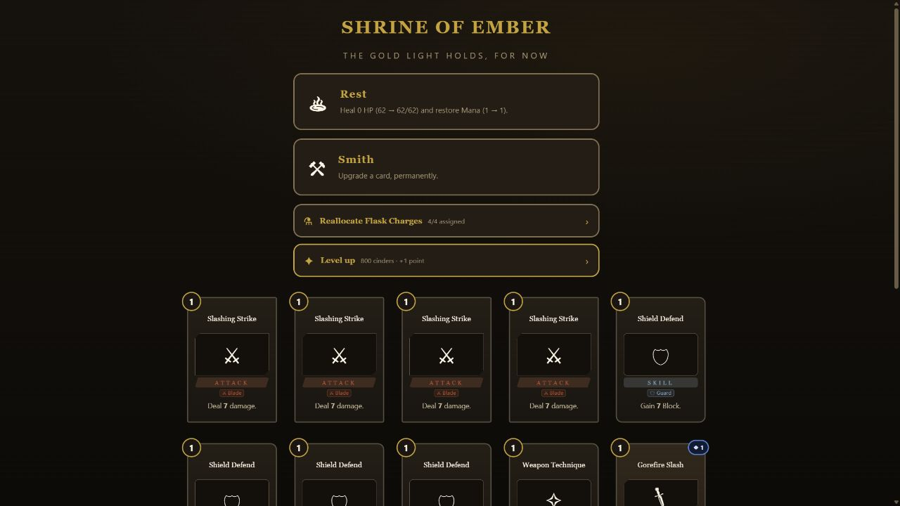
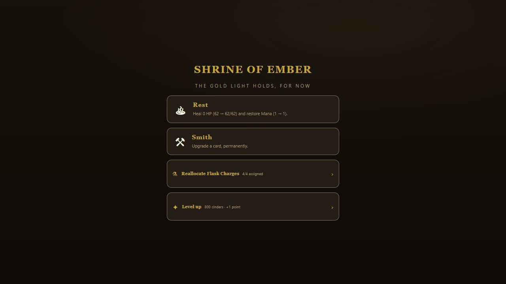
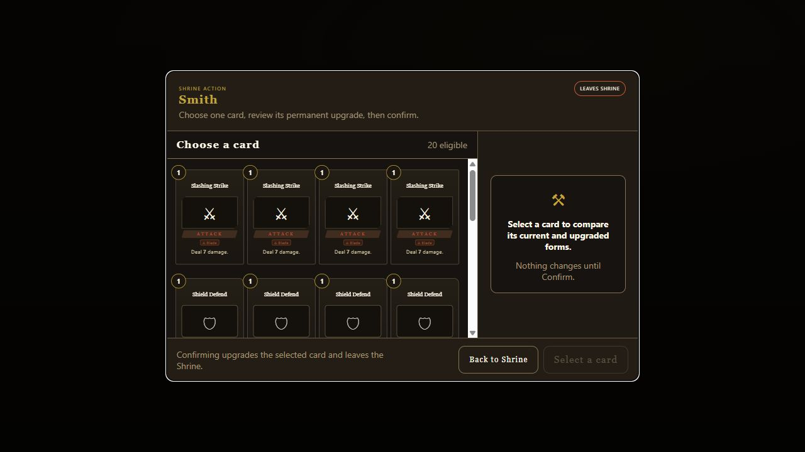
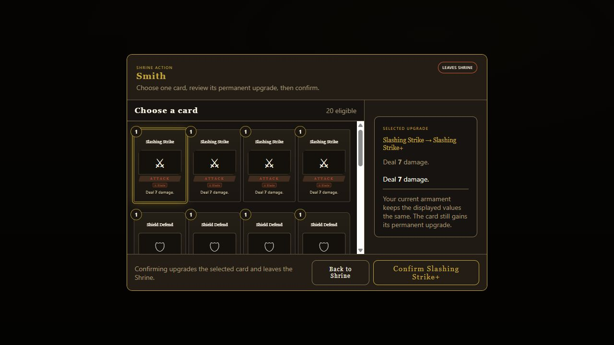
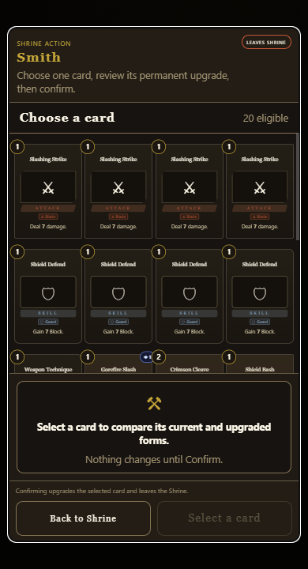
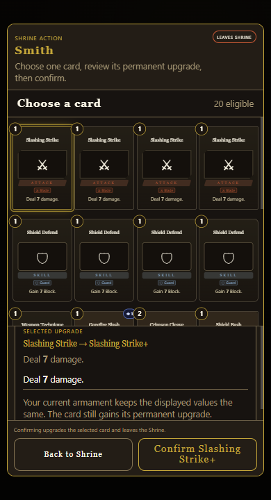

# Smith upgrade modal — design and QA write-up

## Outcome

Smith becomes a dedicated modal transaction. The player chooses one eligible
card, reviews its permanent upgrade, and then explicitly confirms. Back and
Escape return to the Shrine without changing the deck. Confirm upgrades exactly
one card and leaves the Shrine.

The implementation and design QA were completed in build `0.4.0.1361`
(`d0f8dab61b`). After integrating current `origin/dev`, the exact delivery
candidate is build `0.4.0.1362` (`20424f3657`) on base `16d9181d`.

## Problem evidence

The baseline build appended an unlabeled card grid below the Shrine and upgraded
the first clicked card immediately. It had no title, instructions, persistent
selection, before/after review, cancel, or explicit commit boundary.



## Stable component contract

| Stable ID | Model owner | Renderer / primitive | Responsibility |
|---|---|---|---|
| `smith-upgrade-modal` | `SmithSelectionModel` | `mountSmithUpgradeModal` | Dialog, focus scope, reversible choose/review state, Back and Confirm |
| `smith-candidate-card` | `SmithSelectionModel.properties.candidates[]` | shared `renderCard` | One keyboard/touch-selectable upgrade candidate |
| `smith-upgrade-preview` | `SmithSelectionModel.properties.selected` | shared `upgradePreviewHtml` | Current-versus-upgraded comparison or empty prompt |

The Shrine screen coordinates the modal and owns the one permanent mutation.
The model stays DOM-free; the renderer owns dialog semantics and focus; the
shared card primitives keep card content consistent with the rest of the game.

## Proposed design

```text
SHRINE OF EMBER
┌──────────────────────────────────────────────────────────┐
│ [♨] Rest · restore health and Mana                      │
│ [⚒] Smith · upgrade one card, permanently              │
│ [⚗] Reallocate flasks · 4/4 assigned                    │
│ [✦] Level up · 800 cinders · +1 point                   │
└──────────────────────────────────────────────────────────┘

SMITH — CHOOSE
┌──────────────────────────────────────────────────────────┐
│ SHRINE ACTION   SMITH                    LEAVES SHRINE   │
│ Choose one card, review its permanent upgrade.          │
├───────────────────────────────┬──────────────────────────┤
│ CHOOSE A CARD · 5 eligible    │ UPGRADE PREVIEW          │
│ [Card] [Card] [Card]          │ Select a card to compare │
│ [Card] [Card]                 │ Nothing changes yet.     │
├───────────────────────────────┴──────────────────────────┤
│ Confirming upgrades one card and leaves the Shrine.     │
│ [ Back to Shrine ]                         [ Select card ]│
└──────────────────────────────────────────────────────────┘

SMITH — REVIEW
┌──────────────────────────────────────────────────────────┐
│ SHRINE ACTION   SMITH                    LEAVES SHRINE   │
├───────────────────────────────┬──────────────────────────┤
│ [Selected card] [Card] ...    │ SELECTED UPGRADE         │
│                               │ Slashing Strike → +      │
│                               │ Before: Deal 7 damage.    │
│                               │ After:  Deal 7 damage.*   │
├───────────────────────────────┴──────────────────────────┤
│ [ Back to Shrine ]              [ Confirm Slashing Strike+ ]│
└──────────────────────────────────────────────────────────┘

PHONE
┌ SMITH · LEAVES SHRINE ┐
│ cards (scroll)        │
├───────────────────────┤
│ selected preview      │
├───────────────────────┤
│ [ Back ] [ Confirm ]  │
└───────────────────────┘
```

`*` The preview preserves the selected card instance, including current
armament rewrites. When the permanent upgrade changes the base card but the
equipped armament keeps the displayed value equal, the modal says so instead of
claiming a numerical change that the player will not see.

## Acceptance criteria

- Smith opens a modal dialog over the still-present Shrine.
- Confirm starts disabled.
- Selecting a candidate shows one selected state and a readable upgrade preview.
- Opening and selecting do not mutate any deck instance.
- Back and Escape close the modal, preserve the run, and restore focus to Smith.
- Confirm upgrades the selected instance exactly once and leaves the Shrine.
- Keyboard focus remains inside the open dialog; candidates support Enter/Space.
- Primary actions remain at least 44 px; modal content owns its scroll.
- Desktop and phone layouts have no clipped actions, horizontal overflow, or
  selected-card/preview overlap.
- Browser console and command log remain free of new errors.

## QA evidence

Design screenshots: build `0.4.0.1361`, digest `d0f8dab61b`, generated from
local head `78a6e58f`. The exact integrated behavior recheck used build
`0.4.0.1362`, digest `20424f3657`, after merging `origin/dev@16d9181d`.
`build/AshenSpire.html`, `dist/AshenSpire.html`, and the root launcher are
byte-identical in the integrated candidate.

### Final screenshots











### Behavior verdict

| Check | Result | Evidence |
|---|---|---|
| Open by click and keyboard | PASS | Enter opens one `role=dialog`, moves focus inside, and leaves Confirm disabled |
| Reversible selection | PASS | 20 eligible cards; exactly one selected; readable current/upgraded preview; no mutation before confirmation |
| Back | PASS | Closes modal, retains Shrine, restores focus to `#smith-opt`, and reopening starts with zero selected/upgraded candidates |
| Escape | PASS | Same no-mutation and focus-return result as Back |
| Confirm | PASS | Enables only after selection, closes the modal, and advances from Shrine to the map |
| Instance-aware copy | PASS | Slashing Strike correctly displays `7 -> 7` under the current armament and explains that the permanent upgrade still applies |
| Desktop geometry | PASS | 1280x720, no horizontal overflow, 51.8 px action targets |
| Phone geometry | PASS | 390x844: modal and preview wholly inside viewport, no horizontal overflow, 44 px minimum actions; 390x720 screenshot also keeps the review and actions visible |
| Console | PASS | zero warning/error entries after desktop and phone flows, including the exact 1362 recheck |
| Exact integrated behavior | PASS | 20 candidates; Confirm initially disabled; one selected state; Back and Escape restore `#smith-opt`; Confirm leaves the Shrine; 390x844 has no horizontal overflow and keeps both 44 px actions inside the viewport |
| Static/regression gates | PASS | exact 1362 Node suite 110/0; `ui-components` 19/19 plus selftest; 47 watched probes / 77 anchors / 0 dead; shipped aliases 6/6 and byte-identical |

### Iteration findings

1. Build 1359 inherited the generic card tooltip and let it cover the modal
   header. Candidate cards now suppress that tooltip because the modal owns the
   persistent preview.
2. Build 1360 returned focus to a transient element after Back/Escape. The
   caller now supplies the semantic Smith opener explicitly.
3. The current armament can make base and upgraded card text appear numerically
   identical. Build 1361 keeps the truthful values and adds an explicit
   explanation rather than inventing a visible bonus.
