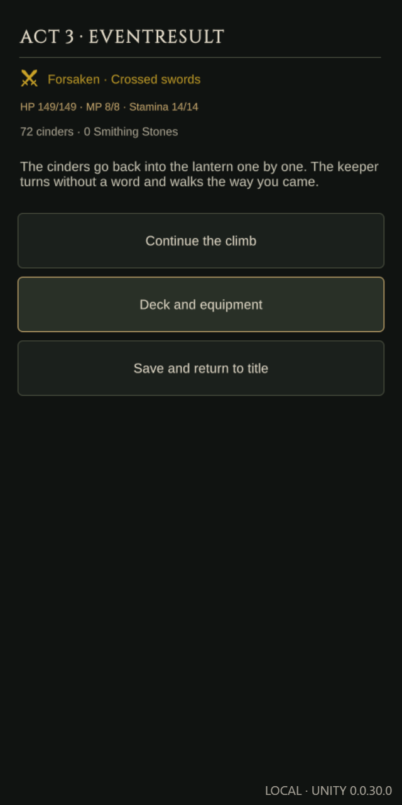
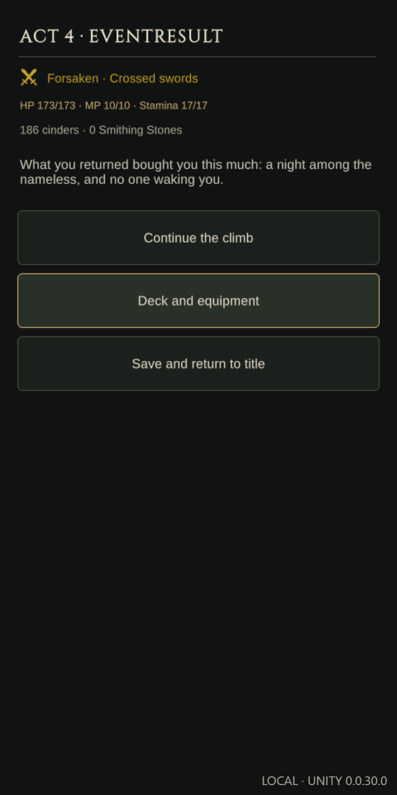
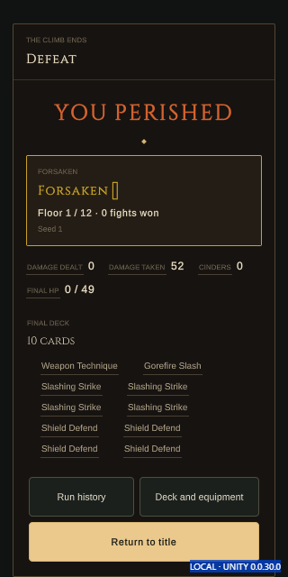
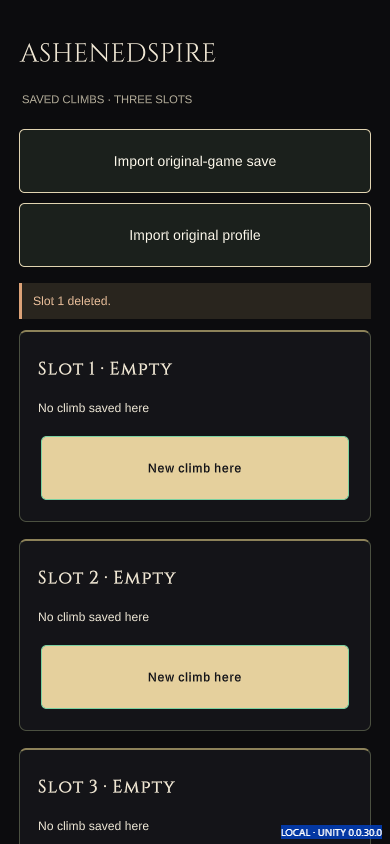
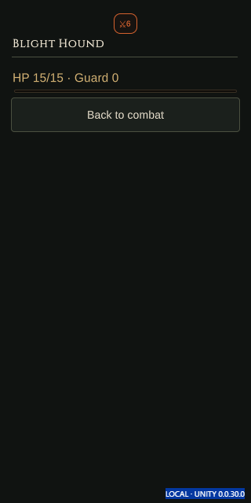
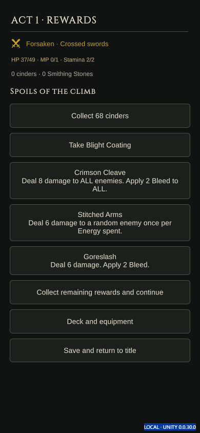
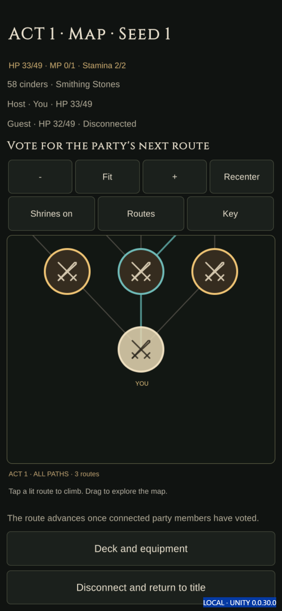

# AshenedSpire — build 31 Phase 2 preview

Version **0.0.30.0**. This is the local Web preview; build 30 remains the
packaged multi-platform checkpoint. These bounded checks passed; owner review
identified missing card-play/presentation quality-of-life features. Phase 2
remains in progress while those gaps are audited and implemented.

- [ ] **Phase 2 — gameplay and presentation**
  - [x] Implement controller navigation/rebinding, accessibility/display options,
    hold confirmation, enemy inspection, room/death transitions, authoritative
    co-op feedback, automatic rewards, merchant buy-back preferences and bundled packs.
  - [x] Unity 6000.6.0f1 compiled and exported the Web player successfully.
  - [x] Focused controls, presentation and service checks, expanded across four viewports.
    - [x] Controls/accessibility: 24 checks at 390×844 and 1440×900, including
      browser-provided virtual gamepad input, rebinding conflicts and persistence.
    - [x] Combat tools: 156 checks at all four target viewports, including enemy
      inspection, unchanged gameplay state and Escape navigation.
    - [x] Rewards: 8 checks, including real combat, completed room/death transitions,
      seeded automatic collection and exact reload.
    - [x] Interface: 64 checks across 320×640, 390×844, 768×1024 and 1440×900.
    - [x] Appearance: 44 checks across Animated, Rendered, Classic and Sigil,
      selected tint/sigil values, paid attacks, recovery and exact reload.
    - [x] Audio: 32 checks observing actual Web Audio PCM and gain, independent
      volume buses, mute, keyboard submit and persistence.
    - [x] Draft/shrine/merchant: 96 checks, including purchased attribute/HP
      improvements, charge allocation, buy-back visibility, payment, resale and reload.
    - [x] Two-player co-op: 26 checks, including real combat, exact-hand rejoin,
      retained peer selection, authoritative impact feedback and host restart.
  - [x] Three-act victory replay: **542 checks and 220 real-input commands**,
    exact reload and recorded Chronicle result.
  - [x] All three authored bosses rendered/fought and Endless Act 4: **559 checks
    and 225 real-input commands**, exact reload and the next cycle's first room.
    These replays use public Custom Climb controls for shorter maps and normal
    combat rules; they are not default-map balance measurements.
  - [x] UI focus interruption during held deletion: **6 checks**. Virtual controller
    navigation cancels the hold; a new short press cannot inherit elapsed time.
  - [x] All 22 events and 62 authored choices: **4,528 checks in eight cases**.
    Each branch starts from a real copied slot and checks costs, inventory,
    authored result text and checkpoint reload. History gates follow real choices.
  - [x] Custom/Sealed/Draft/Endless opening combat and exact reload: 44 checks.
  - [x] Ascensions 0–6 and all 11 modifiers through creation controls: 65 checks.
  - [x] Welcome/guide/About and death/Chronicle layout/navigation: 86 checks.
    Menus, combat tools, paid services and representative campaign/event screens
    cover all four target viewports.
  - [ ] Owner visual/gameplay/listening acceptance.
  - [ ] Physical controller/device and native-platform checks.

[Browser summary](browser-summary.json) records **6,280 assertions across 48 cases**.
[Victory](victory-summary.json) and [Endless](endless-summary.json) have separate
scope/command receipts. Failed or interrupted attempts are excluded from this total.
[Event coverage](event-summary.json) and [mode/layout coverage](mode-layout-summary.json)
record the completed matrix. Sealed/Draft checks cover setup, opening combat
and exact reload; their full campaigns remain separate Foundation work.
[Source and payload receipt](build-source.json) pins the exported files to source
digest `a269b8d1b67b99a951a84cec4f35646c4382688eaea9841a4eea5772b2c27f8d`.
The evidence collector verifies the current source digest, every served payload
hash and each case's matching receipt before copying results. It also refuses
checks left over from a previous invocation.

The initial audio test's Back-navigation failure and the interrupted feature
test are preserved under `TestResults/Phase2/PreviousFailures`. The audio driver
now navigates with the existing Settings section shortcut. Their reruns pass;
the initial failures are excluded from the passing total.

## Editor reference

The [AshenedSpire-Editor receipt](editor-receipt.json) records **21 samples** from
the editor's actual pose validator/sampler, including reduced-flash behavior.
It supplies authoring/timing reference evidence. The Unity player was tested
separately; no original-game or editor files were changed.

## Preview captures















## Reproduce focused checks

Serve `Builds/Web` on loopback port 8791. Use the installed Playwright module and
`AS_BROWSER_GPU=1` for Edge's default GPU renderer on this host. Each playtest
uses isolated browser saves, real pointer/keyboard input and read-only Unity
diagnostics. Co-op's runner owns a temporary local companion and secret state.

```powershell
$env:TEMP='D:/repos/AshenSpire-Unity/TestResults/Phase2/BrowserTemp'
$env:TMP=$env:TEMP
$env:PLAYWRIGHT_MODULE='D:/repos/.codex/cache/phase2-browser/node_modules/playwright'
$env:AS_BROWSER_GPU='1'
node tools/native-phase2-playtest.cjs http://127.0.0.1:8791/ TestResults/Phase2/Browser
node tools/native-combat-tools-playtest.cjs http://127.0.0.1:8791/ TestResults/Phase2/Combat
node tools/native-phase2-rewards-playtest.cjs http://127.0.0.1:8791/ TestResults/Phase2/Rewards
node tools/native-interface-playtest.cjs http://127.0.0.1:8791/ TestResults/Phase2/Layout
node tools/native-audio-playtest.cjs http://127.0.0.1:8791/ TestResults/Phase2/Audio
$env:AS_APPEARANCE_FOCUSED='1'
node tools/native-appearance-playtest.cjs http://127.0.0.1:8791/ TestResults/Phase2/Appearance
node tools/native-features-playtest.cjs http://127.0.0.1:8791/ TestResults/Phase2/Features
$env:AS_COOP_WEB_ROOT='Builds/Web'
$env:AS_COOP_RESTART='1'
$env:AS_COOP_EXPECT_FEEDBACK='1'
node tools/native-coop-ci.cjs TestResults/Phase2/Coop
node tools/native-mode-resume-playtest.cjs http://127.0.0.1:8791/ TestResults/Phase2/Modes
node tools/native-custom-matrix-playtest.cjs http://127.0.0.1:8791/ TestResults/Phase2/CustomMatrix
$env:AS_LAYOUT_MATRIX='1'
$env:AS_TERMINAL_LAYOUT='1'
node tools/native-onboarding-playtest.cjs http://127.0.0.1:8791/ TestResults/Phase2/Onboarding
node tools/native-combat-tools-playtest.cjs http://127.0.0.1:8791/ TestResults/Phase2/Combat
# Repeat native-features-playtest.cjs with ASHENSPIRE_PLAYTEST_WIDTH/HEIGHT
# at 320/640, 768/1024 and 1440/900 into FeaturesLayout/<width>.
# Event fixture/viewport paths are recorded in event-summary.json; replay each
# with native-playtest.cjs using the same viewport and its recorded fixture.
node tools/unity-phase2-evidence.mjs
```

Browser checks do not certify physical devices, audible listening acceptance,
frame-time budgets, every cosmetic permutation or owner acceptance. The full nested
[Phase 2 checklist](../../Unity-Phase-2.md) keeps those boundaries explicit.
