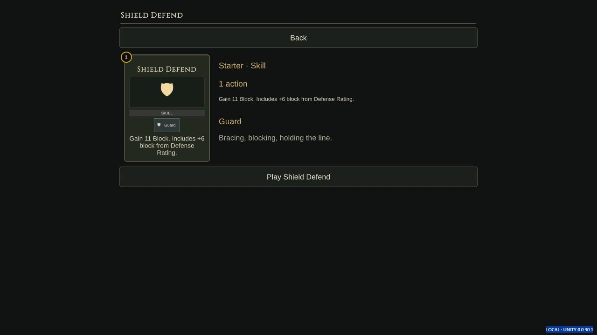
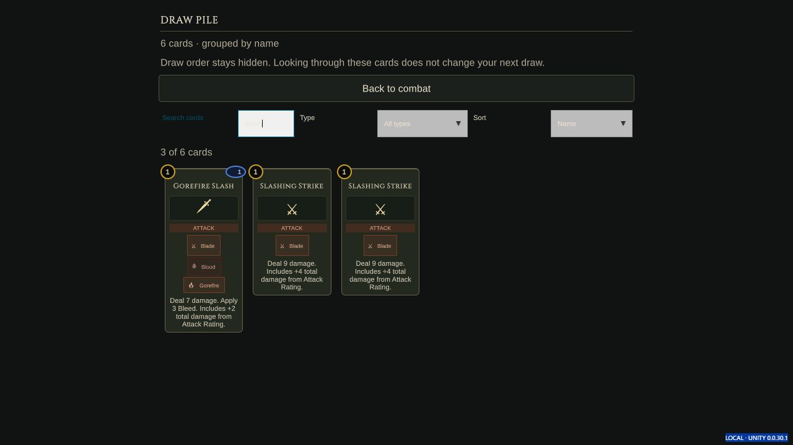
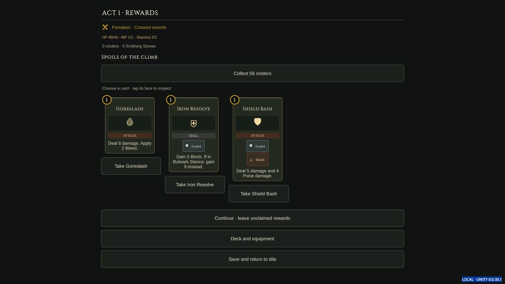
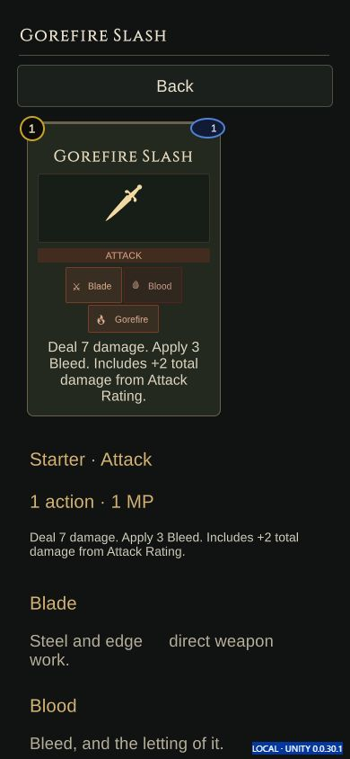

# Build 32 — card quality of life

Version `0.0.30.1`, in progress. This report separates source implementation,
actual exported-player evidence and owner acceptance. Build 31's 6,280 checks
remain evidence for that earlier payload, not verification of this patch.

- [x] Read-only core comparison: an agent played two normal turns in deployed
  test build 765. Local package 410 and remote test metadata 793 differ; see the
  [audit report](core-audit.md).
- [x] Shared faces for solo Draft/rewards/shop/deck/piles and co-op offers/deck.
- [x] Readable cost/effect/tag inspection with context-specific actions.
- [x] Hold/right-click inspection and an explicit Inspect control; closing
  hand inspection cancels its armed selection.
- [x] Search/type/sort controls; preserve filters when returning from inspection.
- [x] Target confirmation: selection spends nothing; legal, affordable armed
  targets highlight and accept a tap to play. Explicit Play remains available.
- [x] Co-op preserves a still-legal target when changing cards. Host authority,
  affordability and recipient checks still determine accepted commands.
- [x] Runtime compile check: 133 source files, with only the tool's existing
  Unity 6 reference-package gaps accepted.
- [x] Co-op domain suite: 461 checks / 146 command batches, three-act victory.
- [x] Final frozen-source Unity Web export: build 32, completed
  `2026-10-02T20:29:27Z`; all eight exported file hashes verified.
- [x] Actual exported-player solo target/self confirmation, explicit Play,
  right-click inspection, Escape cancellation, deck/pile filters and rewards.
- [x] Phone-sized inspector layout at 390 x 844: face and details wrap;
  lower tag explanations remain reachable by scrolling. This is browser
  viewport evidence, not physical-device testing.
- [ ] Hold inspection and target memory with multiple living enemies in the
  fresh exported player; dropdown keyboard navigation remains unverified.
- [ ] Fresh two-peer verification of this patch's co-op UI conveniences.
- [ ] Owner acceptance and physical device/controller checks.

Still separate gaps: drag/flick play, live effect/damage previews and richer
keyword/lore presentation. These are not implied by the passing checks above.

Presentation follow-ups observed in the final player: low-contrast input and
dropdown values, uneven card/offer heights, and the armed enemy still uses a
gold outline rather than the intended hostile colour. Self-target blue and the
explicit target instruction were visible. Treat these as unfinished polish.

## Exported-player evidence

[Final export receipt](build-source.json), source digest
`da4968c5caac3fd65406e95874670dc08dde6bc8defe43a7b6f231cd7bd93b4c`.
The final frozen export supersedes an intermediate build-32 payload that was
built while source was changing. The final `.data` hash is
`b438ce32dafcc61b85beb462535990c99083cf063ba43cf43ba309e240f75b83`.
Compiler log: `TestResults/CardQol/frozen-Web-build.log`, Unity exit 0.

CUA played a fresh isolated origin `http://127.0.0.1:8802/` at 1280 x 720,
seed QOL2026, Reaver/Iron Vanguard, standard attributes, no keepsake. The owner
tab/save at port 8791 was not played. No hidden state or test commands were
used. These are bounded manual interaction checks, not a new full-suite count.

| Interaction | Observed result |
| --- | --- |
| Select Slashing Strike | Enemy remained 26 HP; three actions remained; target instruction appeared. |
| Tap armed enemy | One strike: enemy 26 to 17 HP, actions 3 to 2, discard 0 to 1. |
| Right-click Shield Defend | Face, cost, effects, tags and contextual Play appeared; no play occurred. |
| Press E while reading, then Escape | Stayed on inspection until Escape; combat stayed on turn 1 with two actions. |
| Tap enemy after closing inspection | No card played; enemy remained 17 HP. |
| Select Shield Defend, tap self | Blue self outline; 11 guard, one action left, discard count 2. |
| Deck search and return | Slash showed five of ten cards; Gorefire Slash reader was read-only; query survived return. |
| Deck type and sort | Mouse choice attack showed five cards; Action cost option was selectable. All starting cards share action cost 1, so different-cost ordering was not exercised. |
| Draw pile search and return | Slash showed three of six; inspection offered no Play; query survived return. Combat state remained unchanged. |
| Explicit Play | Remaining strike reduced enemy 17 to 8 HP; zero actions. |
| Turn 2 target tap | Next normal strike won the opening encounter; HP remained 49/49. |
| Reward inspection and claim | Shield Bash had Take rather than Play; Back preserved offers; explicit Take removed offers and deck increased from 10 to 11, with one Shield Bash. |

Browser error-level logs were empty during this session. Repeated emoji-font
warnings remain; no blanket console-clean claim is made. Public UI diagnostic
snapshots are saved in [browser-controls.json](browser-controls.json).

