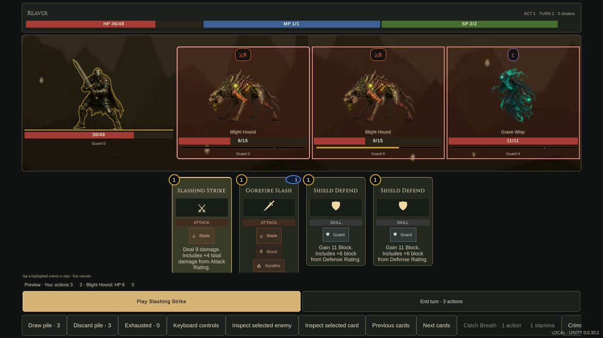
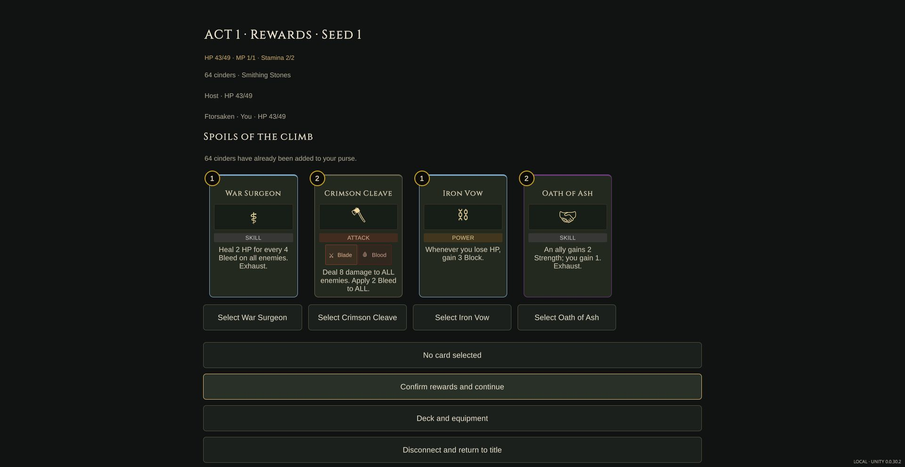

# Build 33 — Phase 2 card interaction completion

Version `0.0.30.2`. Development and player verification are recorded separately
from owner acceptance. Prior build-31 and build-32 reports remain scoped to
their own payloads.

- [x] Implement upward drag and flick-to-target for solo and co-op cards.
  Horizontal movement remains hand browsing; interrupted or invalid drops do
  not send a play command. The host still validates co-op plays.
- [x] Implement live HP, guard, resource and status previews with cloned combat
  rules. No preview saves, notifications, command sequence increments, future
  card identities, peer hands or RNG counters are published.
- [x] Refresh host previews after commands; retain a legal hostile target when
  switching between enemy and friendly cards.
- [x] Polish filter contrast, keyboard Up/Down choices, offer alignment and
  hostile target style priority.
- [x] Add co-op Escape to close a reading view or cancel card selection without
  leaving the shared run. Exported testing found both the missing handler and
  focus loss after rebuilding the hand; both are corrected in the final export.
- [x] Runtime compile check: 135 source files; only the tool's existing three
  Unity 6 reference-package gaps were accepted.
- [x] Final focused preview/flick domain suite: 158 checks. Co-op regression:
  461 checks / 146 command batches through three-act victory. Transient
  target-state suite: 21 checks. Companion Release build: zero warnings/errors.
- [x] Frozen-source Unity Web export and all eight payload hashes verified.
- [x] Final exported-player solo preview, upward drag, target defeat, right-click
  inspection, keyboard type filter and filter retention after Escape.
- [x] Final exported-player two-peer co-op: saved-seat recovery after companion
  restart, affordable-card Escape, reader Escape, contextual play, peer damage,
  next turn, rejected diagonal drag, valid upward drag, victory and reward inspection.
- [ ] Owner visual/play acceptance; physical controller/device testing.

## Final export evidence

The source digest is
`0c9916e6e4bbb00ff3f75803f6696876885b43fb0a311762b15c2adb197cbb90`.
The [build receipt](build-source.json), [source verification](source-verification.json)
and [final browser observations](browser-observations.json) refer to this export.
Solo, host and peer console source URLs each identify that exact digest.

Normal CUA browser inputs played isolated QA saves; the owner's port-8791 save
was not played. In solo, Slashing Strike's preview showed actions 3 → 2 and
hound HP 6 → 0; one upward drop produced that result and one discard. In co-op,
the peer's contextual Strike changed enemy HP 18 → 9 and actions 3 → 2, visible
on both clients. After the next turn, a host drop defeated that enemy and opened
each player's reward offers. Selecting an affordable card and pressing Escape
returned to an unarmed hand without spending. Escape also closed the reader.

The Chrome native drag attempt paused long enough to open inspection; it did
not play a card and is not counted as a successful drag. A separate host drag
with more horizontal than upward movement was correctly rejected. The valid
upward host drop then resolved normally. Physical stationary hold, touch flick
and controller feel remain untested; viewport simulation is not device proof.
Host selected Twinblade Flurry through its reader and confirmed rewards; the
peer selected Iron Vow and confirmed. Both confirmations advanced the shared map.
The preview server remains on port 8791. Browser security policy blocked
refreshing its pre-existing error tab, so the owner must open or refresh that
preview manually. Completed QA tabs and isolated test servers were closed.

The [first export](first-export/) (`da84803c…`) exercised invalid/unaffordable
drops, friendly flick, multi-enemy target memory and live peer-preview refresh.
The [second export](second-export/control-observations.json) (`af522798…`)
verified reader Escape but exposed the armed-card focus gap. Those observations
retain their own provenance and are not presented as final-export reruns.
The historical 6,280 build-31 checks were not rerun on build 33.

Flick defaults follow the current core recognizer: at least 64 reference pixels
upward, predominantly vertical, and at least 300 pixels/second over the latest
120 ms. A direct drop remains valid at slower speeds. Random-effect cards show
that the outcome resolves on play rather than promising a sampled random result.

No original-game or Editor checkout was changed. The editor's existing 21 pose
samples remain reference evidence; its JavaScript content adapters do not author
Unity runtime input or combat rules.
