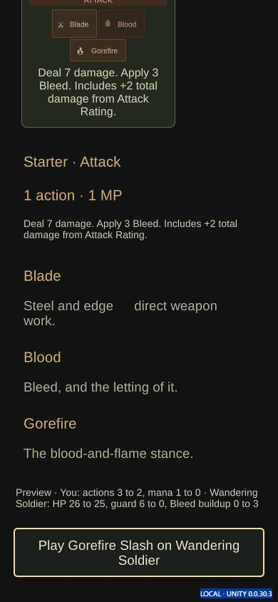

# Build 34 — card readability and platform candidate

Version `0.0.30.3`. Phase 2 polish and Phase 3 delivery work proceed together.

- [x] Shared status formatting uses meter value before stacks in player/enemy
  HUDs, enemy inspection and co-op. Positive thresholds are shown; cleared
  meters show zero rather than stale stacks.
- [x] Live preview ranges use `to`; contextual card/ally Play actions use `on`.
  Status previews distinguish buildup using authored meter/proc definitions.
- [x] Runtime reference compile: 136 files, with the tool's existing three
  Unity-6 reference-package gaps accepted.
- [x] Focused card QoL suite: 169 checks, including 11 new status formatting,
  threshold, reset and nonmutation checks.
- [x] Before editing build 34, Web/Windows/Android build 33 matched digest
  `0c9916e6e4bbb00ff3f75803f6696876885b43fb0a311762b15c2adb197cbb90`;
  all 8/162/1 exported files were verified and preserved in PreviousExports.
- [x] Fresh build-34 Web player: actual card preview/play, buildup HUD and
  enemy inspection at desktop and phone dimensions.
- [x] Matching build-34 Windows/Android/Web/companion delivery and all hashes.
- [ ] Physical devices/controllers, graphical Windows play and owner acceptance.

The local export workflow is `tools/unity-build-candidate.ps1`; it backs up
prior exports, uses D: temporary storage, and verifies a new candidate without
overwriting Published. Native package validation and Web QA remain distinct.
Reference-phone performance budgets and physical measurements remain open.

Build 34's source digest is
`6198e15100ebd3a6c32d23ebf64a9db519601ef1b2845b488d4a53ac17bfc20f`.
The candidate passed 163 native exported-file and 457 companion checks.
The [browser observations](browser-observations.json) record real inputs through
Gorefire Slash: its preview and play changed HP 26 to 25, guard 6 to 0, mana
1 to 0 and Bleed buildup 0 to 3. The live meter showed `3/7` on the phone HUD
and in enemy inspection; the contextual Play action wrapped at 390x844.

That inspection also exposed unresolved `{proc.*}` tokens in the authored
status description. Build 35 addresses this newly observed readability defect.
Build 34 is preserved as evidence rather than presented as the final candidate.

