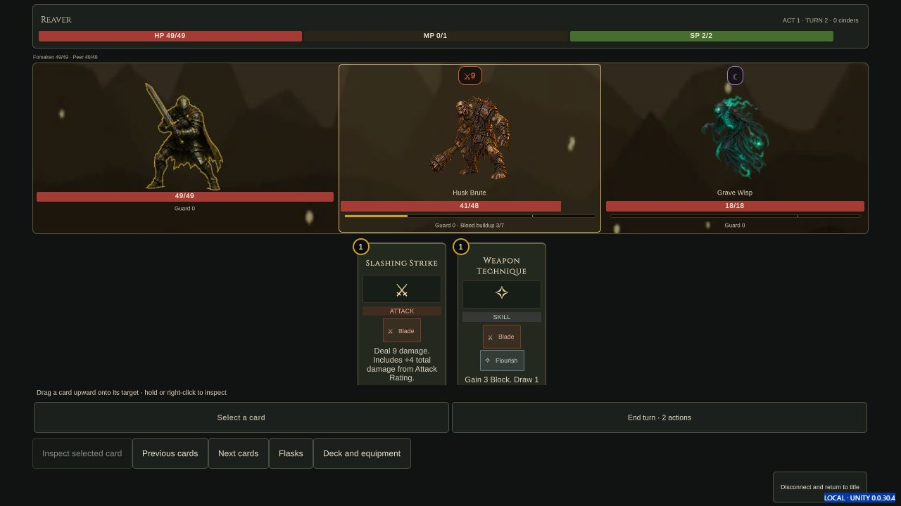
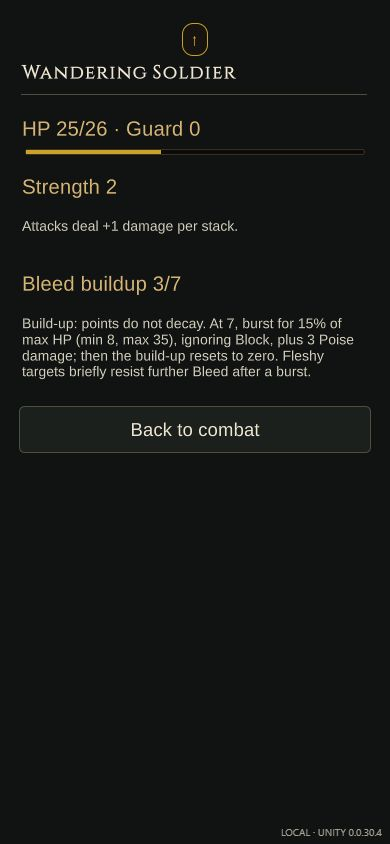

# Build 35 — final status readability and platform candidate

Version `0.0.30.4` continues Phase 2 polish alongside Phase 3 local delivery.
Build 34's separate [observations](../unity-build-34/README.md) exposed authored
status description tokens; build 35 resolves them from content and live meters.

- [x] Meter-first status values and thresholds across solo/co-op combat surfaces.
- [x] Readable `to` preview ranges and `on` contextual Play labels.
- [x] Resolve authored status description numbers and live thresholds; preserve
  unknown bindings, definitions and combat instances.
- [x] Runtime reference compile: 136 files; only the existing three Unity-6
  reference-package API gaps were accepted.
- [x] Focused card QoL: 174 checks, including 16 formatting/nonmutation checks.
- [x] Final Web player: save reload, meter/description and readable card actions.
- [x] Final Windows/Android/Web/companion candidate and all hashes verified:
  163 native payload checks and 457 companion checks.
- [x] Six candidate metadata checks: unchanged input passes; altered download
  size/hash, raw Web size and nested platform provenance are refused.
- [x] Actual portable companion starts and serves the final Web player;
  normal authenticated character creation and lobby join pass.
- [x] Nine final two-player co-op checks against that companion, including
  readable previews/contextual actions, Escape and shared live bleed values.
- [ ] Physical devices/controllers, graphical Windows and owner acceptance.

The export workflow preserves prior players and stages a new local candidate.
Download byte counts describe archives/APKs; raw Web payload size is recorded
separately and is not a measured phone startup time. Device budgets, iOS native
delivery and hosted network/capacity checks remain in [Phase 3](../../Unity-Phase-3.md).

The [Web receipt](build-source.json), [candidate receipt](candidate.json) and
[browser observations](browser-observations.json)
identify source digest
`a17b17e07cf104f75499b8ff7981bec944d44272721cce7e1cdac30df5e8d465`.
All eight Web payload hashes passed. Normal CUA inputs reloaded the build-34
QA save into build 35 with its turn, HP, pools, hand, discard and `3/7` meter
preserved. The resolved description fits desktop and 390x844 phone dimensions.
Escape returned to combat without spending. A phone-sized armed-enemy tap
changed HP 25 to 16, actions 2 to 1 and discard 4 to 5, matching the preview;
the existing buildup remained `3/7`. The card reader names its target with `on`.

The captured console has no errors and one Unity warning about the existing
manual filesystem-sync API being deprecated. Actual save reload passed; this
is not a claim about future Unity versions. The failed initial export was
stopped after its post-processing service stalled; the short-D-temp retry
progressed through compilation and produced the Web receipt above.

The complete local delivery is
`Builds/PlatformCandidates/build35-retry-20261003/Delivery`. Every download is
below 100 MiB; the raw Web runtime is recorded separately in the candidate.
The final workflow verifies current source before and after packaging and
preserves prior exports. The portable companion's startup/lobby check used
loopback-only test credentials and an isolated state file, not a player's save.

A one-seat attempt to start the shared run exposed the raw
`all_players_must_be_ready` message. Friendly readiness feedback is a tracked
Phase 2 follow-up; this receipt does not claim that all lobby polish is finished.

The [co-op observations](coop-browser-observations.json) use shared numeric
seed `2026` with separate `127.0.0.1:8813` and `localhost:8813` browser storage.
Both players authenticated and voted into battle through normal inputs. Host
Weapon Technique selection spent nothing; its reader showed `Play Weapon
Technique on Forsaken`, and Escape canceled reading/selection without spending.
The actual play changed guard 0 to 3 and actions 3 to 2, matching its preview.
After one normal shared turn, the peer's Gorefire Slash reader showed `Play
Gorefire Slash on Husk Brute`. Its actual play changed enemy HP 48 to 41, mana
1 to 0 and actions 3 to 2; both clients displayed `Bleed buildup 3/7`. The host
retained its own mana 1 and actions 3.

A separately served peer on port 8814 was rejected by the expected origin
check. The successful peer used the companion-served `localhost:8813` page
with a matching WebSocket authority; no origin/authentication protection was
changed. Captured final consoles have zero errors, with two host and twelve
peer warnings about the existing filesystem-sync API and unavailable emoji
font support. These counts cover the captured pass, not the entire session.

